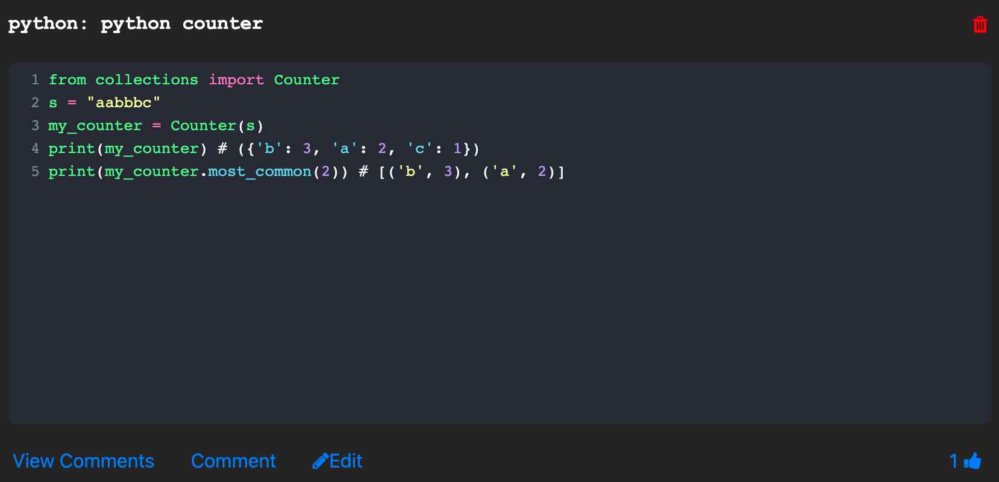

# Snippet Stack
This project is deployed at: https://snippet-stack.herokuapp.com

## Dependencies
Python 3.6\
SQLite 3.34.0\
Flask 1.1.2

## Installation
To run this project in development mode, use:\
`pip install -r requirements.txt`\
`python3 snippetApp.py`

## Demo
<b>Login / Registration:</b>\

 
 

 
 
<b>Create a new snippet</b>\

 
 
<b>Search snippets</b>\

 
 

 
 
