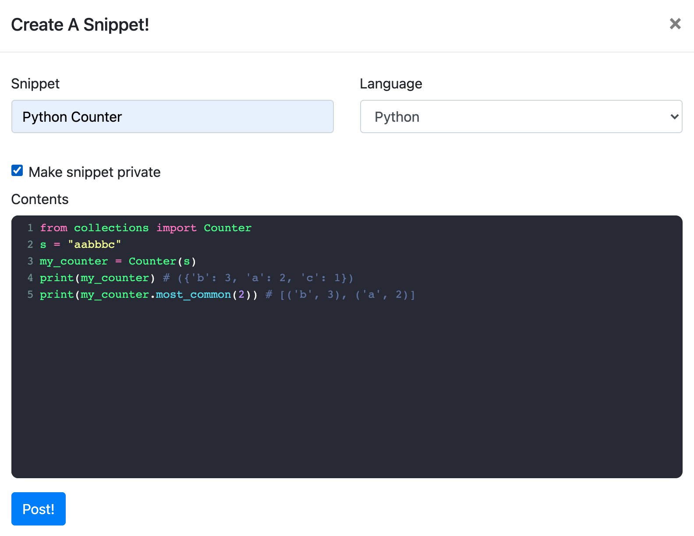

# Snippet Stack
This project is deployed at: https://snippet-stack.herokuapp.com

## Dependencies
Python 3.6 
SQLite 3.34.0 
Flask 1.1.2 
gunicorn 20.0.4 
Werkzeug==1.0.1 

## Installation
To run this project in development mode, use: 
pip install -r requirements.txt 
python3 snippetApp.py

## Demo
Login / Registration:

 
 
Creating a new snippet

